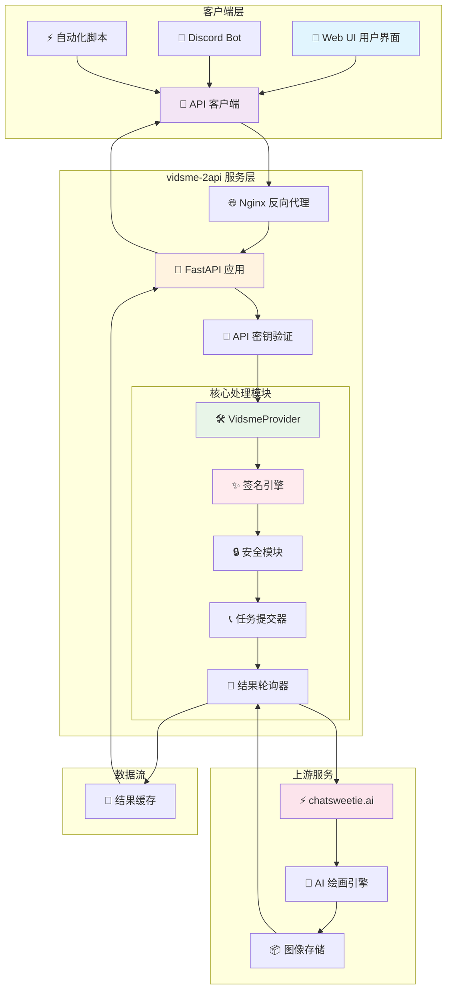
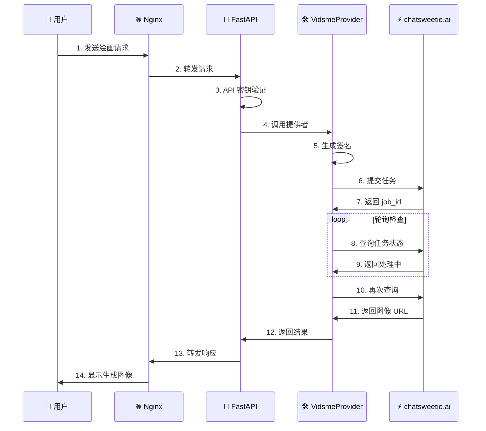
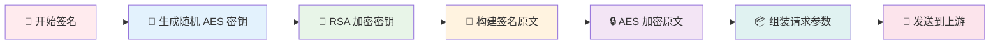
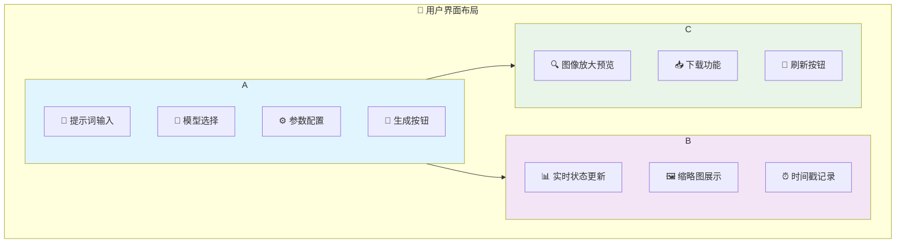
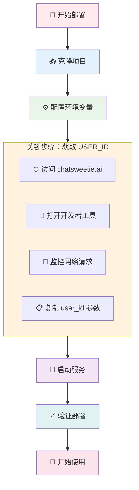
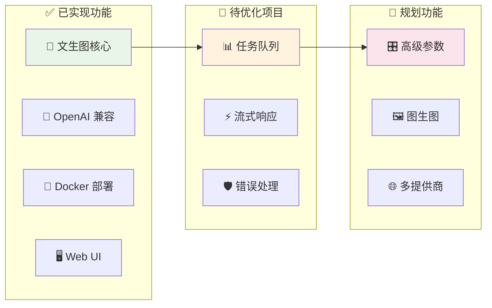

# 🚀 vidsme-2api：你的个人 AI 绘画魔法杖 ✨


> "任何足够先进的技术，都与魔法无异。" —— 亚瑟·克拉克

欢迎来到 `vidsme-2api` 的世界！在这里，我们不只是在编写代码，我们是在**驯化数字世界的魔法**。这个项目的核心思想很简单，却蕴含着深刻的哲学：**将复杂、封闭的 AI 服务，转化为简单、开放、人人可用的工具**。

我们相信，创造力不应该被复杂的接口和专有的系统所束缚。每个人都应该能轻松地驾驭 AI 的力量，就像挥舞魔法棒一样简单。`vidsme-2api` 就是这样一根魔法棒，它将 `chatsweetie.ai` (vidsme) 强大而有趣的图像生成能力，封装成了全球开发者都熟悉和喜爱的 OpenAI API 格式。

这不仅仅是一个"代理"或"转换器"，它是：
* 🌉 **一座桥梁** - 连接专有服务与开放生态
* 🔑 **一把钥匙** - 解锁在任何支持 OpenAI 的应用中使用 vidsme 模型的可能性
* 💌 **一份邀请函** - 邀请你一起探索、学习、改进，并最终创造出属于你自己的魔法

---

## 🌟 核心特性

* 🧙‍♂️ **OpenAI 格式兼容** - 像调用 `dall-e-3` 一样调用 vidsme！无缝集成到任何支持 OpenAI 图像生成 API 的现有应用、脚本或服务中
* ⚡ **高性能异步架构** - 基于 `FastAPI` 构建，拥有闪电般的响应速度和高并发处理能力
* 🎨 **多模型支持** - 轻松切换 `anime` (动漫), `realistic` (写实), `hentai`, `hassaku` 等多种绘画模型
* 📦 **Docker 一键部署** - "懒人福音"！一条命令即可启动整个服务，无需关心复杂的环境配置
* 🖥️ **自带 Web UI** - 内置美观、易用的高级测试面板，让你在浏览器中直观体验 AI 绘画乐趣，管理历史记录
* 🔐 **安全可靠** - 支持 API Key 认证，保护你的服务不被滥用
* 🛠️ **高度可扩展** - 代码结构清晰，无论是添加新模型、新功能还是新的上游服务，都易如反掌

---

## 📊 项目当前状态

| 功能模块 | 状态 | 完成度 | 描述 |
|---------|------|--------|------|
| **核心功能** | ✅ 已完成 | 100% | 实现了 `text-to-image` 的核心代理功能，兼容 OpenAI 格式 |
| **多模型支持** | ✅ 已完成 | 100% | 支持 vidsme 的主要模型切换 |
| **Web UI 面板** | ✅ 已完成 | 100% | 提供功能完善的前端界面用于测试和预览 |
| **Docker 部署** | ✅ 已完成 | 100% | 提供 `Dockerfile` 和 `docker-compose.yml`，实现一键部署 |
| **聊天接口适配** | ✅ 已完成 | 100% | 巧妙地将 `/v1/chat/completions` 接口也适配为文生图功能 |
| **任务队列** | ⚠️ 规划中 | 0% | 目前使用简单轮询，未来可升级为专业任务队列（如 Celery） |
| **流式响应** | ⚠️ 规划中 | 30% | `sse_utils.py` 已存在，但未在主逻辑中完全利用 |
| **高级功能** | ❌ 未开始 | 0% | 负向提示词、`img2img`、精细化参数调整等 |

---

## 🏗️ 系统架构总览



---

## 🤔 这个项目解决了什么？

### 优势亮点 👍

1. **🚪 降低使用门槛** - 无需研究 `chatsweetie.ai` 私有的、可能随时变化的 API 签名算法
2. **🌐 生态无缝集成** - 将 vidsme 模型接入 Discord 机器人、自动化工作流等原本只支持 OpenAI 的应用
3. **📚 绝佳学习案例** - 涵盖 API 设计、逆向工程、加解密、前后端交互、Docker 部署等全栈技能
4. **💫 创造乐趣** - 通过自己的努力将封闭系统变得开放，享受创造美丽图像的成就感

### 挑战与局限 🧗

1. **🔗 上游依赖风险** - 如果 `chatsweetie.ai` 的接口或签名算法发生重大变化，项目可能需要更新
2. **⚡ 签名算法维护** - `security.py` 中的签名逻辑需要持续关注和逆向工程技巧
3. **🎛️ 功能相对基础** - 目前主要实现核心文生图功能，高级控制功能有待扩展

---

## 📂 项目架构详解

```
📂 vidsme-2api/
├── 📄 .env                    # 🔧 本地配置文件
├── 📄 .env.example            # 📋 配置模板
├── 📄 Dockerfile              # 🐳 应用容器构建
├── 📄 docker-compose.yml      # ⚙️ 服务编排配置
├── 📄 main.py                 # 🚀 FastAPI 主入口
├── 📄 nginx.conf              # 🌐 反向代理配置
├── 📄 requirements.txt        # 📦 Python 依赖
├── 📂 app/                    # 💻 核心应用代码
│   ├── 📂 core/              # ⚙️ 配置管理
│   │   ├── 📄 __init__.py
│   │   └── 📄 config.py      # 🔑 配置加载验证
│   ├── 📂 providers/         # 🔌 服务提供者
│   │   ├── 📄 __init__.py
│   │   ├── 📄 base_provider.py    # 🏗️ 抽象基类
│   │   └── 📄 vidsme_provider.py  # 🎨 核心业务逻辑
│   └── 📂 utils/             # 🛠️ 工具模块
│       ├── 📄 security.py    # ✨ 签名算法实现
│       └── 📄 sse_utils.py   # 📡 SSE 事件流
└── 📂 static/                # 🎨 前端资源
    ├── 📄 index.html         # 📄 UI 主页面
    ├── 📄 script.js          # ⚡ 交互逻辑
    └── 📄 style.css          # 🎨 样式设计
```

---

## 🛠️ 技术深度解析

### 1. 整体架构：优雅的四步流程



### 2. 魔法核心：签名算法解析



**技术要点详解：**

| 技术组件 | 作用 | 难度 | 学习路径 |
|---------|------|------|----------|
| `cryptography` 库 | 实现 RSA 和 AES 加解密 | ⭐⭐⭐⭐ | 搜索 "Python RSA encrypt with public key" |
| RSA + AES 混合加密 | 安全交换对称密钥并签名 | ⭐⭐⭐⭐ | 分析前端 JS 代码，Python 复现逻辑 |
| 异步任务处理 | 处理长时间运行的图像生成任务 | ⭐⭐⭐ | 理解 Python asyncio 和线程池 |

### 3. 前端 UI 设计理念



**用户体验特性：**
- ⚡ **即时反馈** - 加载动画、状态实时更新
- 🎯 **直观布局** - 三栏设计，功能分区明确
- 💾 **数据持久化** - 本地存储历史记录
- 🛡️ **容错处理** - 清晰的错误提示和重试机制

---

## 🚀 快速开始指南

### 前置要求

- 🐳 [Docker](https://www.docker.com/get-started) 
- ⚙️ [Docker Compose](https://docs.docker.com/compose/install/)

### 部署流程图



### 详细步骤

#### 第一步：获取项目代码
```bash
git clone https://github.com/lzA6/vidsme-2api.git
cd vidsme-2api
```

#### 第二步：配置环境
```bash
cp .env.example .env
```

编辑 `.env` 文件：
```env
# 🔐 建议修改为复杂密码
API_MASTER_KEY=your_secret_api_key_here

# 🌐 服务端口（如被占用可修改）
NGINX_PORT=8088

# 🆔 替换为实际获取的 USER_ID
USER_ID=your_actual_user_id_here
```

#### 第三步：获取 USER_ID

1. **🌐 访问** [chatsweetie.ai](https://chatsweetie.ai/)
2. **🔧 按 F12** 打开开发者工具
3. **📡 切换到 Network 标签页**
4. **🎨 发送一个图像生成请求**
5. **📋 在请求参数中找到并复制 `user_id`**


#### 第四步：启动服务
```bash
docker-compose up -d
```

等待服务启动完成，看到 `done` 提示即表示部署成功！

### 验证部署

#### 🖥️ 访问 Web UI
打开浏览器访问：`http://localhost:8088`

#### 🔌 API 调用示例
```bash
curl -X POST "http://localhost:8088/v1/images/generations" \
  -H "Authorization: Bearer your_secret_api_key" \
  -H "Content-Type: application/json" \
  -d '{
    "model": "anime",
    "prompt": "a cute cat wearing a wizard hat casting spells",
    "n": 1,
    "size": "1:1"
  }'
```

---

## 🗺️ 未来发展蓝图

### 当前架构评估



### 技术演进路线

#### 🟢 短期目标（1-2个月）
- **📊 引入任务队列** - 使用 Celery + Redis 替换简单轮询
- **⚡ 实现流式响应** - 完善 SSE 支持，提升用户体验
- **🛡️ 增强错误处理** - 更友好的错误信息和重试机制

#### 🟡 中期目标（3-6个月）  
- **🎛️ 支持高级参数** - 负向提示词、seed、steps 等专业控制
- **🖼️ 实现图生图功能** - 基于现有架构扩展图像处理能力
- **🔧 动态配置管理** - 支持运行时配置更新

#### 🔴 长期愿景（6-12个月）
- **🌐 多提供商架构** - 抽象 Provider 接口，支持 NovelAI、Midjourney 等
- **👥 多用户系统** - 用户管理、API 配额、计费系统
- **🔌 插件化生态** - 社区贡献的 Provider 插件系统

### 贡献指南

我们欢迎各种形式的贡献！无论是：

- 🐛 **问题反馈** - 提交 Issue 报告 bug 或建议功能
- 🔧 **代码贡献** - 提交 Pull Request 实现新功能
- 📚 **文档改进** - 完善使用文档和开发指南
- 💡 **创意分享** - 提出有趣的想法和使用场景

**开始贡献：**
1. Fork 本仓库
2. 创建功能分支 (`git checkout -b feature/AmazingFeature`)
3. 提交更改 (`git commit -m 'Add some AmazingFeature'`)
4. 推送到分支 (`git push origin feature/AmazingFeature`)
5. 开启 Pull Request

---

## ❤️ 致谢与开源精神

这个项目的存在，离不开 `chatsweetie.ai` 团队创造出如此优秀的 AI 绘画服务。同时，也感谢 `FastAPI`、`Cloudscraper` 等众多开源项目的开发者们，我们是站在巨人的肩膀上。

`vidsme-2api` 本身也是开源精神的体现。它代表着一种信念：**我们不仅是技术的使用者，更是技术的塑造者。** 通过分享、协作和创造，我们可以让这个数字世界变得更加开放、互联和充满乐趣。

希望这个项目能给你带来价值，无论是一张让你会心一笑的图片，一个让你豁然开朗的技术知识点，还是一份投身开源创造的热情。

---

## 📄 许可证

本项目基于 Apache 2.0 许可证开源 - 查看 [LICENSE](LICENSE) 文件了解详情。

---

**那么，年轻的魔法师，拿起你的魔杖，开始创造吧！🌍✨**
